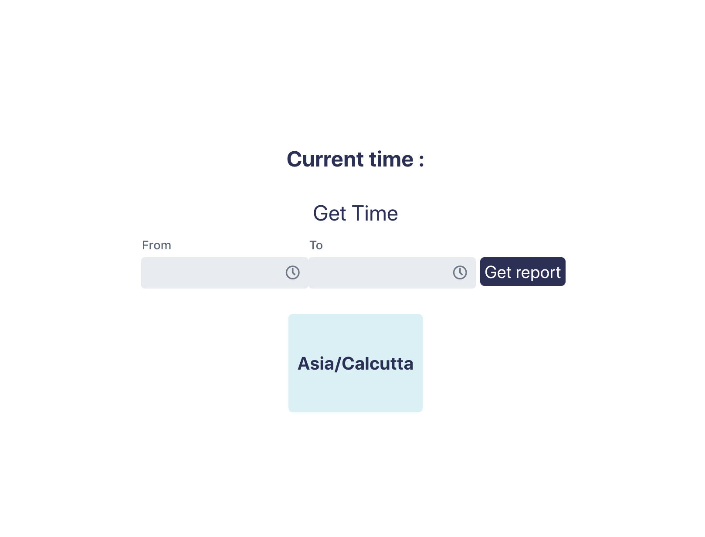
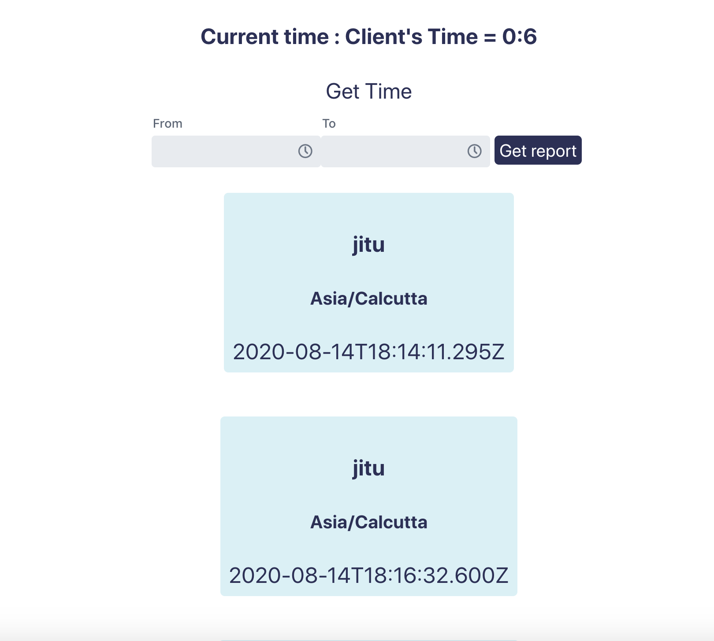
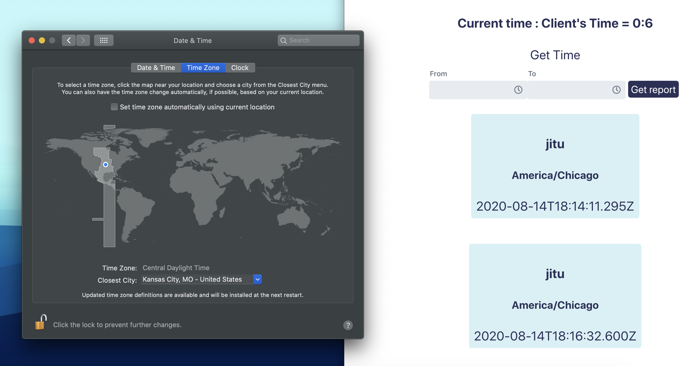
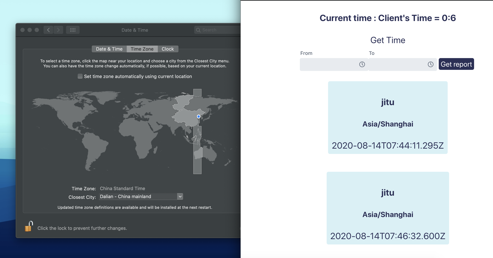

# TimeSeries-API-React-SpringBoot 
#random

```
## Checkout both backend and frontend branches for full code

Mongo DB stores data in UTC format only.
But while fetching based on client's TimeZone and converts and reply back
```

## * Clicking Get Time would save client's time and username in Backend Mongo DB



## * Clicking Get Report would fetch list of users and their API fetching timestamp in current timezone



## * If client's location is changed. API converts timseStamp based on client's current location 


## * Works any timeZone and offset.



## Mongo DB stores data in UTC format only. but while fetching based on client's TimeZone and converts and reply back
